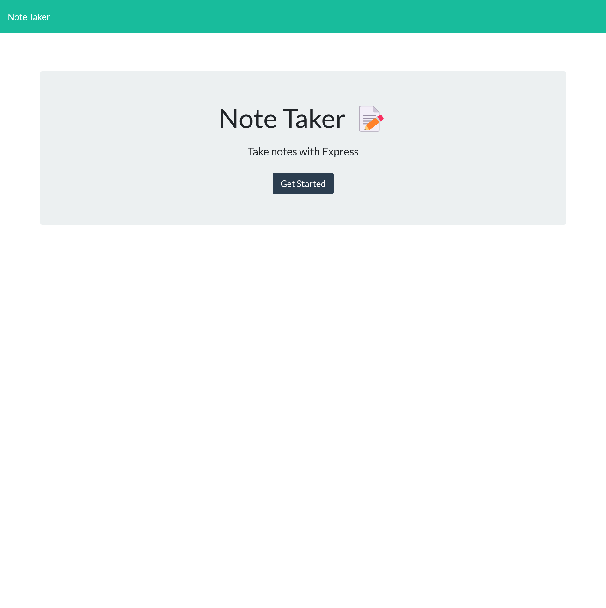
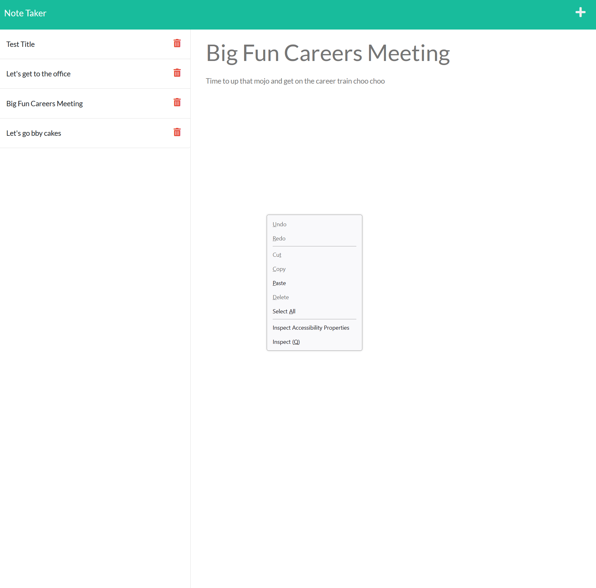

# Note Taker Starter Code

A backend for an e-commerce website.

### Link To Application

[Note Taker App](https://fast-earth-81206.herokuapp.com/)

## Table of Contents 📃

1. [Description](#description)
2. [Screenshot](#screenshots)
3. [Installation](#installation)
4. [Usage](#usage)
5. [Technology](#technology)
6. [Features](#features)
7. [Credits](#credits)
8. [License](#license)
9. [Contribution Guidelines](#contribution-guidelines)
10. [Feedback](#feedback)

## Description

The purpose of this application is to create a note taker that can be used to write and save notes. Express.js is used as the backend to help create the routes and will render,create and delete the note data from a JSON file. Finally the app is live and deployed to heroku.

The application is a backend application that can do the following:

- Render a homepage using routes
- Render a list of notes from the JSON file when the notes link is selected
- Create and save notes to the JSON file and have them persist on the application
- Render a selected note when the user selects the note they wish to see
- Delete a note when the user clicks on the delete icon

### User Story 👤

AS A small business owner
I WANT to be able to write and save notes
SO THAT I can organize my thoughts and keep track of tasks I need to complete

### What did I Learn 🏫

The big take away from this project was learning how to use Express.js to set up a server and how to use HTTP requests to update files, thus allowing data to persist on the page.

Other things I learned:

- How to use the nanoid to create unique identifiers
- How to use routes to render specific pages
- How to use APIs to access data
- How to use Insomnia Core to test APIs
- How to deploy an application to heroku

## Screenshots

### Homepage Screenshot

## Notes Page Screenshot

## Installation

In order to install this note taker app and test it you need to follow these steps.

1. Ensure that you have node and npm installed

   - [Download Node](https://nodejs.org/en/download/)

   - For detailed instructions on installing node please follow [this link](https://docs.npmjs.com/downloading-and-installing-node-js-and-npm) for instructions

2. Clone this repository into your local repository.

   - `git clone git@github.com:TheInfamousGrim/note-taker-heroku.git`.

3. Install the dependencies

   - `npm install`

If you've followed these steps correctly then the application should be good to go and can be tested using software like [Insomnia Core](https://insomnia.rest/) 😁

## Usage

### Link To Application

[Note Taker App](https://fast-earth-81206.herokuapp.com/)

### Run From localhost:3001

If you'd like to run the application locally follow these steps after installation:

1. run the application with `npm run start`
2. Open your web-browser and use the following url

   - http://localhost:3001/notes

## Technology

The technology used for the development of this app was:

dev-dependencies:

- [nodemon](https://www.npmjs.com/package/nodemon)

dependencies:

- [express](https://www.npmjs.com/package/express)
- [nanoid](https://www.npmjs.com/package/nanoid)

## Features

- Uses express.js to create and run a server
- Updates a JSON file when creating and deleting notes
- Has a functional API
- Deployed to heroku

## Credits

🙏 Made with the help of:

- [University of Birmingham Coding Bootcamp](https://www.birmingham.ac.uk/postgraduate/courses/cpd/coding-boot-camp.aspx)

## License

[MIT License](/LICENSE)

## Contribution Guidelines

I'm open to have anyone jump in and contribute just message me on [twitter](https://twitter.com/VaporWhy)

[Guidelines for contributing](/code_of_conduct.md)

## Feedback

Any feedback please email [George Fincher](mailto:finchergeorge1@gmail.com)

GitHub: [TheInfamousGrim](https://api.github.com/users/TheInfamousGrim)

Twitter: [GrimFunk](https://twitter.com/VaporWhy)
